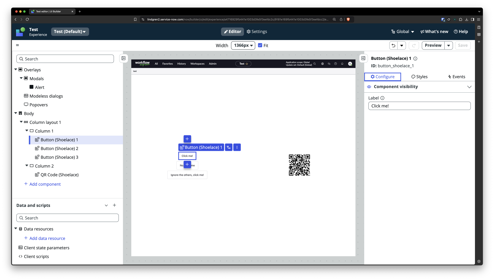

# ServiceNow Component – Runtime Dependency Example

Typically external dependencies are included in UI Framework on Next Experience projects at build-time. This is done by using `npm install` to add the dependency to your `package.json`, and using `import` at the top of files that use those dependencies.

However, in doing so, each time a new version of the dependency is released in order to receive that new version into your project you're required to build the project again, and redeploy that built code to your instance.

This in many cases is the behaviour you want, but not in all cases. For example, if the library contains components for which their contract is fixed (e.g. component name, properties, events etc), but new versions are often published with internal bug fixes and improvements, you may want to load the library at run-time.

This repository shows how external dependencies containing web components can be imported at run-time, and leveraged to make those web components accessible within UI Builder.

The external dependency I have used to illustrate this is [Shoelace](https://shoelace.style/). I have chosen to make available to UI Builder two components from this library by wrapping each in a separate [UI Framework on Next Experience component](https://developer.servicenow.com/dev.do#!/reference/next-experience/xanadu/ui-framework/getting-started/introduction). I selected these two components in particular so that working with both properties & events could be shown.

- [QR Code](https://shoelace.style/components/qr-code) – makes use of properties.
- [Button](https://shoelace.style/components/button) – makes use of properties and events.

Each component of the external dependency that you want to be distinct in UI Builder needs to have its own wrapper UI Framework on Next Experience component. Each of these needs to be surfaced in UI Builder through configuration in the `now-ui.json` file.

The key here is that although you are technically creating a UI Framework on Next Experience component for each component of the external dependency, all the complexity of these components is handled by the external dependency. The UI Framework on Next Experience component is just a wrapper to simply publish the component to an instance and inform the instance of how to interact with it through properties and events.

Shoelace can be loaded via a CDN using the following HTML code:

```html
<link rel="stylesheet" href="https://cdn.jsdelivr.net/npm/@shoelace-style/shoelace/cdn/themes/light.css" />
<script type="module" src="https://cdn.jsdelivr.net/npm/@shoelace-style/shoelace/cdn/shoelace.js" ></script>
```
Each component will need to place this code on the page to ensure that Shoelace is loaded. It's done in this example using the [shoelace.js](https://github.com/dylanlindgren/sn-component-runtime-dependency-example/blob/d410ecffc848ce010be45b2fa2bfafd598497b1e/src/shoelace.js) file:

```javascript
import { Fragment } from "@servicenow/ui-renderer-snabbdom";

export const shoelace = () => (
	<Fragment>
		<link
			rel="stylesheet"
			href="https://cdn.jsdelivr.net/npm/@shoelace-style/shoelace/cdn/themes/light.css"
		/>
		<script
			type="module"
			src="https://cdn.jsdelivr.net/npm/@shoelace-style/shoelace/cdn/shoelace.js"
		></script>
	</Fragment>
);
```

### Properties
Now, within for example the definition of the Button [as a UI Framework on Next Experience component](https://github.com/dylanlindgren/sn-component-runtime-dependency-example/blob/d410ecffc848ce010be45b2fa2bfafd598497b1e/src/snc-wds-sl-qr-code/index.js) we can import `shoelace` and then call it to generate the HTML to load Shoelace.

```javascript
import { createCustomElement } from "@servicenow/ui-core";
import snabbdom from "@servicenow/ui-renderer-snabbdom";
import { shoelace } from "../shoelace";

const view = (state) => {
	const { properties } = state;

	return (
		<div>
			{shoelace()}
			<sl-qr-code
				value={properties.value}
				label={properties.label}
			></sl-qr-code>
		</div>
	);
};

createCustomElement("snc-wds-sl-qr-code", {
	renderer: { type: snabbdom },
	properties: {
		value: {
			default: "",
		},
		label: {
			default: "",
		},
	},
	view,
});
```

Really all the code above is doing is wrapping the `<sl-qr-code>` element and ensuring that the properties defined on the UI Framework on Next Experience component (that can be supplied by UI Builder) make their way onto its `value` and `label` properties. All the logic of actually generating the QR code is left to Shoelace's `<sl-qr-code>` element.

### Events
As Shoelace components emit normal DOM events – as is the standard for web components – they can be listened to using the technique described in the "Event handlers" section of the [Component View page](https://developer.servicenow.com/dev.do#!/reference/next-experience/xanadu/ui-framework/main-concepts/view) of the official developer documentation.

```javascript
import { createCustomElement } from "@servicenow/ui-core";
import snabbdom from "@servicenow/ui-renderer-snabbdom";
import { shoelace } from "../shoelace";

import {
	SHOELACE_BUTTON_BLUR,
	SHOELACE_BUTTON_FOCUS,
	SHOELACE_BUTTON_INVALID,
	BUTTON_CLICKED,
} from "../constants";

const view = (state, dispatch) => {
	const { properties } = state;
	return (
		<div>
			{shoelace()}
			<sl-button
				on-sl-focus={(payload) => dispatch(SHOELACE_BUTTON_FOCUS, payload)}
				on-sl-blur={(payload) => dispatch(SHOELACE_BUTTON_BLUR, payload)}
				on-sl-invalid={(payload) => dispatch(SHOELACE_BUTTON_INVALID, payload)}
				on-click={(payload) => dispatch(BUTTON_CLICKED, payload)}
				size="large"
			>
				{properties.label}
			</sl-button>
		</div>
	);
};

createCustomElement("snc-wds-sl-button", {
	renderer: { type: snabbdom },
	properties: {
		label: {
			default: "",
		},
	},
	view,
});
```

Calling `dispatch()` ensures that a standard DOM event is converted into an event that can be listened for in UI Builder.

### Example Usage

| Screenshot | Description |
| ---------- | ----------- |
|| The properties panel of the QR Code UI Component.<br /><br />These properties come from [lines 4-21 of the now-ui.json file](https://github.com/dylanlindgren/sn-component-runtime-dependency-example/blob/d410ecffc848ce010be45b2fa2bfafd598497b1e/now-ui.json#L4).|
||The properties panel of the Button UI Component.<br /><br />This property comes from [line 32-41 of the now-ui.json file](https://github.com/dylanlindgren/sn-component-runtime-dependency-example/blob/d410ecffc848ce010be45b2fa2bfafd598497b1e/now-ui.json#L32).<br /><br />There are 3 instances of the component on the page, each with different properties.|
||The events panel of the Button UI Component.<br /><br />These events come from the actions [defined on lines 50-71 of the now-ui.json](https://github.com/dylanlindgren/sn-component-runtime-dependency-example/blob/d410ecffc848ce010be45b2fa2bfafd598497b1e/now-ui.json#L50) file.<br /><br />All 3 buttons are set up to open the same Alert native modal when clicked, which is configured in UI Builder.|
||The Alert native modal as configured in UI Builder.|
|| The resultant page, with 3 instances of the same Button component, and one of the QR code.<br /><br />Although it's the same component, each instance of the component has a different Label property supplied.|
||Clicking one of the buttons opens a native modal dialog configured in UI Builder.|
